# 🚀 Tableau Dashboard Generator

**AI-Powered Automatic Tableau Dashboard Creation**

Transform your data into compelling Tableau dashboards with the power of AI. This production-grade application uses Azure OpenAI, Langchain, and meta-prompting techniques to automatically analyze your data and generate professional Tableau workbooks—including support for advanced Tableau calculations such as table calculations and Level of Detail (LOD) expressions.

## ✨ Features

- **🤖 AI-Powered Analysis**: Intelligent data analysis using Azure OpenAI and meta-prompting
- **📊 Automatic Dashboard Generation**: Creates complete Tableau workbooks (.twb/.twbx)
- **🎯 Business-Focused**: Tailors dashboards based on your business goals and audience
- **🔄 Workflow Orchestration**: Uses Langgraph for robust, scalable workflow management
- **🌐 Web Interface**: Intuitive Streamlit-based interface for easy interaction
- **⚡ Production Ready**: Comprehensive logging, error handling, and validation
- **🎨 Smart Visualizations**: Recommends optimal chart types and layouts
- **📈 KPI Generation**: Automatically identifies and creates key performance indicators
- **🧮 Advanced Calculations**: Supports Tableau calculated fields, including table calculations and LOD expressions

## 🏗️ Architecture

```
┌─────────────────┐    ┌──────────────────┐    ┌─────────────────┐
│   Streamlit UI  │ -> │  Langgraph       │ -> │  Tableau Engine │
│                 │    │  Workflow        │    │                 │
└─────────────────┘    └──────────────────┘    └─────────────────┘
                                │
                                v
                       ┌──────────────────┐
                       │   AI Analysis    │
                       │   (Azure OpenAI) │
                       └──────────────────┘
```

### 📊 Langgraph Workflow Architecture

**Why Langgraph?** Langgraph provides robust state management, conditional routing, and checkpoint persistence—essential for multi-step dashboard generation workflows where failures must be recoverable and state must be maintained across complex orchestration.

#### Dashboard Generation Workflow State Flow


**Workflow Rationale:**
- **Linear primary path** ensures data flows through validation → analysis → generation → finalization
- **Error handling at each stage** prevents cascading failures
- **Checkpoint persistence** allows recovery from failures mid-workflow

#### Detailed Langgraph Node Architecture

```mermaid
graph TB
    subgraph "WorkflowState Management"
        WS["WorkflowState<br/>├── dataset_schema<br/>├── business_goals<br/>├── target_audience<br/>├── ai_analysis<br/>├── generation_request<br/>├── generated_result<br/>├── errors<br/>└── warnings"]
    end
    
    subgraph "Node 1: Input Validation"
        N1["validate_input_node<br/>────────────<br/>✓ File format check<br/>✓ Data structure<br/>✓ Column validation<br/>✓ Size limits"]
    end
    
    subgraph "Node 2: AI Analysis"
        N2["analyze_data_node<br/>────────────<br/>✓ Schema inference<br/>✓ Quality assessment<br/>✓ KPI identification<br/>✓ Viz recommendations"]
    end
    
    subgraph "Node 3: Workbook Generation"
        N3["generate_workbook_node<br/>────────────<br/>✓ XML creation<br/>✓ Data embedding<br/>✓ Calculations<br/>✓ Visualizations"]
    end
    
    subgraph "Node 4: Finalization"
        N4["finalize_result_node<br/>────────────<br/>✓ Package TWBX<br/>✓ Validation<br/>✓ Logging<br/>✓ Cleanup"]
    end
    
    subgraph "Error Handler"
        N5["handle_error_node<br/>────────────<br/>✓ Log errors<br/>✓ Collect warnings<br/>✓ Return status"]
    end
    
    subgraph "External Services"
        ES1["Azure OpenAI<br/>LLM Service"]
        ES2["Tableau Engine<br/>XML Generator"]
    end
    
    WS -->|State In| N1
    N1 -->|State Out| N2
    N2 -->|Calls| ES1
    N2 -->|State Out| N3
    N3 -->|Calls| ES2
    N3 -->|State Out| N4
    N4 -->|Returns| WS
    
    N1 -->|On Error| N5
    N2 -->|On Error| N5
    N3 -->|On Error| N5
    N5 -->|Returns| WS
    
    style WS fill:#263238,stroke:#1C1C1C,stroke-width:2px,color:#fff
    style N1 fill:#2E7D32,stroke:#1B5E20,stroke-width:2px,color:#fff
    style N2 fill:#1976D2,stroke:#1565C0,stroke-width:2px,color:#fff
    style N3 fill:#D32F2F,stroke:#B71C1C,stroke-width:2px,color:#fff
    style N4 fill:#F57C00,stroke:#E65100,stroke-width:2px,color:#fff
    style N5 fill:#C62828,stroke:#880E4F,stroke-width:2px,color:#fff
    style ES1 fill:#455A64,stroke:#37474F,stroke-width:2px,color:#fff
    style ES2 fill:#455A64,stroke:#37474F,stroke-width:2px,color:#fff
```



**Node Architecture Reasoning:**
- **Separation of Concerns**: Each node handles a single responsibility
- **State Threading**: WorkflowState flows through all nodes, accumulating results
- **External Service Isolation**: AI and Tableau engines called within nodes, not at node level
- **Error Isolation**: Dedicated error handler prevents workflow corruption

#### Conditional Routing Logic


**Conditional Logic Rationale:**
- **Multi-condition gates** ensure all validations pass before proceeding
- **Fail-fast approach** prevents wasted processing on bad data
- **Clear branching** enables debugging and state inspection

#### State Management & Checkpoint Recovery

```mermaid
graph TB
    subgraph "Checkpointing Strategy"
        CP["MemorySaver Checkpoint<br/>└── Preserves state at each node"]
    end
    
    subgraph "Failure Scenario"
        F1["Failure at Node 3<br/>generate_workbook_node"]
    end
    
    subgraph "Recovery Path"
        R1["Resume from Checkpoint<br/>├── Restore state from Node 2<br/>├── Skip nodes 1-2<br/>└── Retry Node 3 with new params"]
    end
    
    CP --> F1
    F1 --> R1
    
    style CP fill:#263238,stroke:#1C1C1C,stroke-width:2px,color:#fff
    style F1 fill:#C62828,stroke:#880E4F,stroke-width:2px,color:#fff
    style R1 fill:#2E7D32,stroke:#1B5E20,stroke-width:2px,color:#fff
```



**Checkpoint Reasoning:**
- **Fault Tolerance**: System can recover from transient failures (API timeouts, etc.)
- **Resource Efficiency**: Avoids re-running successful nodes after failures
- **Production Reliability**: Essential for long-running workflows

#### Integration with Streamlit & External Systems

```mermaid
graph TB
    subgraph "Streamlit UI Layer"
        SUI["StreamlitApp<br/>├── File Upload<br/>├── Config Input<br/>├── Progress Display<br/>└── Download"]
    end
    
    subgraph "Langgraph Orchestration"
        WF["DashboardGenerationWorkflow<br/>├── StateGraph<br/>├── Node Execution<br/>├── Conditional Routing<br/>└── Error Handling"]
    end
    
    subgraph "Processing Layer"
        AI["AI Engine<br/>Azure OpenAI<br/>Meta-Prompting"]
        TB["Tableau Engine<br/>XML Generation<br/>Calculations"]
    end
    
    subgraph "Data Management"
        DM["Data Processor<br/>├── Upload Storage<br/>├── Temp Files<br/>└── Output Storage"]
    end
    
    SUI -->|Triggers Workflow| WF
    WF -->|Calls AI Services| AI
    WF -->|Calls Workbook Gen| TB
    WF -->|Uses File Ops| DM
    TB -->|Returns TWBX| SUI
    AI -->|Returns Analysis| WF
    
    style SUI fill:#1565C0,stroke:#0D47A1,stroke-width:2px,color:#fff
    style WF fill:#512DA8,stroke:#311B92,stroke-width:2px,color:#fff
    style AI fill:#D32F2F,stroke:#B71C1C,stroke-width:2px,color:#fff
    style TB fill:#00796B,stroke:#004D40,stroke-width:2px,color:#fff
    style DM fill:#F57C00,stroke:#E65100,stroke-width:2px,color:#fff
```



**Integration Reasoning:**
- **Decoupled Services**: Streamlit, AI, and Tableau engines are independently testable
- **Single Orchestrator**: Langgraph manages all coordination, reducing coupling
- **Clear Data Flow**: Input → Processing → Output with explicit state transitions

#### Event Flow Timeline


**Timeline Reasoning:**
- **Sequential node execution** ensures dependencies are met
- **State accumulation** builds complete context for each step
- **Early error detection** prevents downstream failures
- **User feedback** available at each stage via progress tracking
- **Color-coded stages** visually distinguish workflow phases:
  - 🟢 **Green (#2E7D32)**: Validation & Safety checks
  - 🔵 **Blue (#1976D2)**: Intelligence & Analysis
  - 🔴 **Red (#D32F2F)**: Generation & Processing
  - 🟠 **Orange (#F57C00)**: Finalization & Delivery
  - 🟤 **Charcoal (#263238)**: User & Error Context
- **Colored rectangular backgrounds** provide visual context blocks for each stage
- **Clear participant identification** with emoji + descriptive labels

**Timeline Reasoning:**
- **Sequential node execution** ensures dependencies are met
- **State accumulation** builds complete context for each step
- **Early error detection** prevents downstream failures
- **User feedback** available at each stage via progress tracking
- **Color-coded stages** visually distinguish workflow phases:
  - 🟢 **Green (#2E7D32)**: Validation & Safety checks
  - 🔵 **Blue (#1976D2)**: Intelligence & Analysis
  - 🔴 **Red (#D32F2F)**: Generation & Processing
  - 🟠 **Orange (#F57C00)**: Finalization & Delivery

---

### Prerequisites

- **Python 3.8+**
- **Azure OpenAI API access** (required for AI features)
- **Virtual environment** (recommended)

### 1. Clone and Setup

```bash
git clone <repository-url>
cd Tableau_Workbook_Generator
python -m venv tableau_env
source tableau_env/bin/activate  # On Windows: tableau_env\Scripts\activate
pip install -r requirements.txt
```

### 2. Configuration

Copy the environment template and configure your settings:

```bash
cp .env.template .env
```

Edit `.env` with your Azure OpenAI credentials:

```env
AZURE_OPENAI_ENDPOINT=https://your-resource.openai.azure.com/
AZURE_OPENAI_API_KEY=your-api-key-here
AZURE_OPENAI_DEPLOYMENT_NAME=your-deployment-name
AZURE_OPENAI_MODEL_NAME=gpt-4-turbo
```

### 3. Run the Application

```bash
# Method 1: Direct execution
python main.py

# Method 2: Via Streamlit CLI
streamlit run main.py

# Method 3: Custom port
streamlit run main.py --server.port 8502
```

The application will be available at `http://localhost:8501`

## 📋 Usage Guide

### Step 1: Upload Data 📤
- Drag and drop your data file (CSV, Excel, JSON, Parquet)
- Maximum file size: 100MB
- Automatic data validation and preprocessing
- Preview your data and column analysis

### Step 2: Define Requirements 🎯
- Specify your business goals
- Select your target audience  
- Choose dashboard preferences
- Set interactivity and style options

### Step 3: AI Analysis 🤖
- AI analyzes your data structure and quality
- Generates insights and business recommendations
- Suggests optimal KPIs and visualizations
- Provides design and layout recommendations

### Step 4: Generate Dashboard 📊
- Creates complete Tableau workbook
- Includes sample data, visualizations, and calculated fields
- **Supports advanced Tableau calculations:** Table calculations (e.g., `WINDOW_SUM([Sales])`), LOD expressions (e.g., `{ FIXED [Region] : SUM([Sales]) }`), and custom formulas
- Downloads ready-to-use .twbx file
- Compatible with Tableau Desktop/Server

## 📁 Project Structure

```
Tableau_Workbook_Generator/
├── src/
│   ├── models/           # Data models and schemas
│   ├── ai_engine/        # AI analysis and meta-prompting
│   ├── tableau_engine/   # Tableau workbook generation
│   ├── workflows/        # Langgraph workflow orchestration
│   ├── ui/              # Streamlit web interface
│   └── utils/           # Configuration, logging, utilities
├── data/
│   ├── uploads/         # Uploaded data files
│   ├── outputs/         # Generated Tableau workbooks
│   └── temp/           # Temporary processing files
├── logs/               # Application logs
├── config.yaml         # Application configuration
├── .env.template       # Environment variables template
├── requirements.txt    # Python dependencies
├── main.py            # Application entry point
└── README.md          # This file
```

## ⚙️ Configuration

### Environment Variables

| Variable | Description | Required |
|----------|-------------|----------|
| `AZURE_OPENAI_ENDPOINT` | Azure OpenAI service endpoint | Yes |
| `AZURE_OPENAI_API_KEY` | API key for authentication | Yes |
| `AZURE_OPENAI_DEPLOYMENT_NAME` | Deployment name for your model | Yes |
| `AZURE_OPENAI_MODEL_NAME` | Model name (e.g., gpt-4-turbo) | No |
| `LOG_LEVEL` | Logging level (DEBUG/INFO/WARNING/ERROR) | No |

### Configuration File (`config.yaml`)

The application uses a comprehensive YAML configuration file for settings:

- **Application settings**: Name, version, debug mode
- **Azure OpenAI parameters**: Temperature, max tokens, API version
- **Dashboard generation**: Visualization types, color schemes, limits
- **Data processing**: File size limits, supported formats
- **Meta-prompting**: System prompts for different AI roles

## 🔧 Advanced Usage

### Custom Business Goals

The application supports various business analysis goals:

- **Performance Tracking**: Monitor KPIs and metrics
- **Trend Analysis**: Identify patterns over time
- **Comparative Analysis**: Compare across categories
- **Operational Monitoring**: Track efficiency metrics
- **Customer Analytics**: Understand user behavior
- **Financial Analysis**: Measure financial performance

### Dashboard Styles

Choose from different dashboard approaches:

- **Executive Summary**: High-level overview with key metrics
- **Detailed Analysis**: Comprehensive data exploration
- **Operational Monitoring**: Real-time operational dashboards
- **Exploratory**: Interactive analysis tools

### Output Formats

- **TWBX**: Complete packaged workbook with data included
- **TWB**: XML workbook file (requires separate data connection)

### Advanced Tableau Calculations

- **Calculated Fields:** Automatically generated and inserted into Tableau workbooks
- **Table Calculations:** AI and user-defined formulas such as `WINDOW_SUM`, `RUNNING_AVG`, etc.
- **Level of Detail (LOD) Expressions:** Full support for `{ FIXED ... }`, `{ INCLUDE ... }`, `{ EXCLUDE ... }` syntax
- **Custom Formulas:** Any valid Tableau calculation can be included via AI or user input

## 🛠️ Development

### Architecture Components

1. **Data Models** (`src/models/`): Pydantic schemas for type safety
2. **AI Engine** (`src/ai_engine/`): Meta-prompting and analysis
3. **Tableau Engine** (`src/tableau_engine/`): Workbook XML generation
4. **Workflows** (`src/workflows/`): Langgraph orchestration
5. **UI Layer** (`src/ui/`): Streamlit web interface
6. **Utilities** (`src/utils/`): Configuration and logging

### Key Technologies

- **Azure OpenAI**: GPT-4 for intelligent analysis
- **Langchain**: LLM application framework
- **Langgraph**: Workflow orchestration
- **Streamlit**: Web interface framework
- **Pydantic**: Data validation and serialization
- **Pandas**: Data processing and analysis
- **LXML**: XML processing for Tableau files

### Extending the Application

#### Adding New Visualization Types

1. Update `VisualizationType` enum in `src/models/schemas.py`
2. Add mapping in `_get_tableau_mark_type()` in `src/tableau_engine/generator.py`
3. Update AI prompts to recommend the new visualization type

#### Custom Data Sources

1. Extend `DataProcessor` class in `src/utils/data_processor.py`
2. Add new file format support in `load_data_file()` method
3. Update supported formats in configuration

#### Advanced AI Prompting

1. Modify system prompts in `config.yaml`
2. Extend `TableauDashboardAnalyzer` in `src/ai_engine/analyzer.py`
3. Add new analysis chains for specific use cases

#### Advanced Calculations

- To add new types of Tableau calculations, update the AI prompt templates and ensure your schema supports the formula.
- The generator will automatically include any valid Tableau calculation in the workbook XML.

## 📊 Supported Data Sources

- **CSV Files**: Comma-separated values
- **Excel Files**: .xlsx format (any sheet)
- **JSON Files**: Structured JSON data
- **Parquet Files**: Columnar data format

### Data Requirements

- **Minimum**: 2 rows, 1 column
- **Maximum**: 100MB file size, 1M rows recommended
- **Quality**: Automatic validation and suggestions
- **Types**: Numeric, categorical, datetime, boolean data

## 🚦 Troubleshooting

### Common Issues

#### "Calculation formula warning"
- If a KPI or calculated field formula is empty or suspicious, a warning will be logged.
- Ensure formulas follow Tableau syntax for table calculations and LOD expressions.

#### "Azure OpenAI API key not configured"
- Ensure `.env` file exists with correct credentials
- Verify API key has proper permissions
- Check endpoint URL format

#### "Data validation failed"
- Check file format and size limits
- Ensure data has proper structure
- Review validation warnings and suggestions

#### "Generation failed"
- Check AI analysis completed successfully
- Verify all requirements are specified
- Review error logs in `logs/` directory

### Debug Mode

Enable debug mode by setting `DEBUG=true` in `.env`:

```env
DEBUG=true
LOG_LEVEL=DEBUG
```

This provides detailed logging and error information.

### Log Files

Application logs are stored in the `logs/` directory:

- **tableau_generator.log**: Main application log
- **Rotation**: Daily rotation with 30-day retention
- **Format**: Structured logging with timestamps and context

## 🤝 Contributing

We welcome contributions! Please see our contribution guidelines:

## 🛡️ Known Limitations & Suggestions

Tableau Dashboard Generator is designed for reliability and real-world use, but like any evolving open-source project, there are areas for further enhancement. We want to be transparent about current limitations and encourage users to adapt or contribute improvements:

- **Authentication & Access Control:**  
  The Streamlit interface does not include built-in user authentication. For sensitive or multi-user environments, consider deploying behind a secure gateway or integrating with your organization's authentication system.

- **Enterprise Scalability:**  
  The app is ideal for small teams and internal use. For high-concurrency or enterprise deployments, containerization (e.g., Docker), cloud hosting, or scaling Streamlit with load balancers is recommended.

- **Automated Testing & CI/CD:**  
  While testing is encouraged, automated test coverage and CI/CD pipelines are not included out-of-the-box. Contributions to strengthen these areas are very welcome!

- **Monitoring & Alerting:**  
  External monitoring and alerting integrations are not yet provided. You can add tools like Prometheus, Grafana, or cloud-native monitoring for production deployments.

- **Session Management:**  
  Multi-user session support is limited. For collaborative use, consider deploying multiple instances or integrating with session management solutions.

**How You Can Help:**  
We encourage users and contributors to adapt the project to their needs, share improvements, and help us make this Tableau Dashboard Generator even better. If you have ideas, solutions, or enhancements, please open an issue or submit a pull request!

---

1. Fork the repository
2. Create a feature branch
3. Make your changes
4. Add tests and documentation
5. Submit a pull request

### Development Setup

```bash
# Install development dependencies
pip install -r requirements.txt

# Run tests
pytest tests/

# Format code
black src/
flake8 src/

# Type checking
mypy src/
```

## 🌟 Why Use Tableau Dashboard Generator?

- **Production-Ready:** Built for reliability, scalability, and real-world business needs.
- **AI-Driven Insights:** Leverage cutting-edge AI to automate dashboard creation, KPI generation, and advanced Tableau calculations.
- **No Tableau Expertise Needed:** Instantly create professional dashboards—no manual design or deep Tableau knowledge required.
- **Customizable & Extensible:** Modular architecture lets you adapt, extend, and integrate with your analytics workflows.
- **Open Source:** Free to use, modify, and contribute—empowering the data community.
- **Community-Driven:** Built for and by data enthusiasts, analysts, and business leaders.

---

## 🚀 Who Should Use This?

- **Data Analysts & BI Professionals:** Automate dashboard creation and focus on insights, not manual work.
- **Business Leaders & Decision Makers:** Get instant, actionable visualizations tailored to your goals.
- **Developers & Data Engineers:** Integrate AI-powered dashboarding into your data pipelines and products.
- **Educators & Students:** Learn and teach modern analytics, AI, and Tableau best practices.
- **Open Source Contributors:** Join a growing community and help shape the future of AI-driven analytics.

---

## 💡 What Makes This Unique?

- **End-to-End Automation:** From raw data to ready-to-use Tableau dashboards in minutes.
- **Advanced Tableau Support:** Seamlessly handles calculated fields, table calculations, and LOD expressions.
- **Business Context Awareness:** Dashboards are tailored to your goals, audience, and KPIs.
- **Modern Tech Stack:** Azure OpenAI, Langchain, Streamlit, and robust workflow orchestration.
- **Comprehensive Logging & Error Handling:** Designed for production use and easy troubleshooting.

---

## 📣 Spread the Word & Show Your Support!

- **Star this repo** ⭐️ to show your appreciation and help others discover it.
- **Share your experience** on social media, blogs, or with your data teams.
- **Present at meetups or conferences:** Inspire others with your Tableau automation journey.
- **Write a tutorial or case study:** Show how this tool transformed your workflow.
- **Submit issues and feature requests:** Help us improve and grow.
- **Contribute code, docs, or tests:** Every contribution makes a difference!
- **Mention us in your talks, newsletters, and communities.**

---

## 🤝 How to Contribute

1. **Fork this repo and clone it locally.**
2. **Create a new branch** for your feature or fix.
3. **Write clear, tested code and update documentation.**
4. **Submit a pull request** – we’ll review and merge!

---

## ❤️ Show More Love

- **Add a ⭐️ to this repo!**
- Tell your colleagues, friends, and network.
- Use the tool, give feedback, and help us grow the community.
- Help translate docs or write about your use case.

---

> ### ⭐️ Why Star, Clone, and Fork This Repo?
>
> - If this project saved you time or made dashboarding easier
> - If you believe in open source and want to support community-driven analytics
> - If you want to see more features, improvements, and active maintenance
> - If you want to help others in the data community discover these resources
> - If you want to encourage the maintainers to keep building and sharing
> - If you simply want to say "thank you" for a humble attempt to help the community
> - If you want to customize, extend, or contribute—clone and fork the repo!

Every star, clone, and fork helps this project reach more users, inspires new contributions, and motivates us to keep making it better. Thank you for your support!

---

## 🌍 Make It More Popular

- **Tweet about it, post on LinkedIn, and share in Slack/Discord channels.**
- **Present it at your local data meetups or conferences.**
- **Add it to awesome-lists and open source directories.**
- **Help us translate docs or write case studies.**

---

## 🚦 Ready to Supercharge Your Tableau Experience?

**Clone, fork, star, and share Tableau Dashboard Generator today!  
Let’s build the future of AI-powered analytics together.**

---

**Built with ❤️ for the data visualization community**
---
